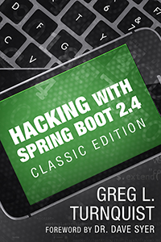

== Hacking with Spring Boot 2.4: Classic Edition

*Spring Boot 2.4* is what everyone turns to build top-of-the line systems...

...when it comes to Java application development. Learn the latest features that can make your apps rock solid including:

* Web and Data access
* Developer tools and test support
* Operational features
* Docker container baking
* Messaging
* Security
* More!

Written cover-to-cover using Java's de facto toolkit, Spring, your apps will perform like never before.

https://www.amazon.com/Hacking-Spring-Boot-2-3-Reactive-ebook/dp/B086722L4L/[Grab your copy today] and learn to build top-notch, scalable solutions with modern tactics.

https://www.amazon.com/Hacking-Spring-Boot-2-3-Reactive-ebook/dp/B086722L4L/[]

*Greg L. Turnquist* works on the Spring team as a principal developer at VMware.
He is a committer to Spring HATEOAS, Spring Data, Spring Boot, R2DBC, and Spring Session for MongoDB.
He wrote _Hacking with Spring Boot 2.3: Reactive Edition_ amongst his many technical tomes and hosts https://www.youtube.com/SpringBootLearning[_Spring Boot Learning_], the YouTube channel where you learn about Spring Boot and have fun doing it.
He founded the Nashville JUG in 2010 and hasn't met a Java app (yet) he doesn't like.

== Code for the book

This is a standing repo of the code for _Hacking with Spring Boot 2.4: Classic Edition_.

CAUTION: No have Java? I suggest you download and install https://sdkman.io/[sdkman] and use it to install your favorite version of Java 8!

Stay tuned. In the meantime, http://www.urbandictionary.com/define.php?term=share%20and%20enjoy[share and enjoy]!

== Licensing

The code in this project is licensed http://apache.org/licenses/LICENSE-2.0.txt[Apache License v2.0].

== Contributions

Please read the related link:CONTRIBUTING.adoc[CONTRIBUTING] document if you are interested in making contributions.